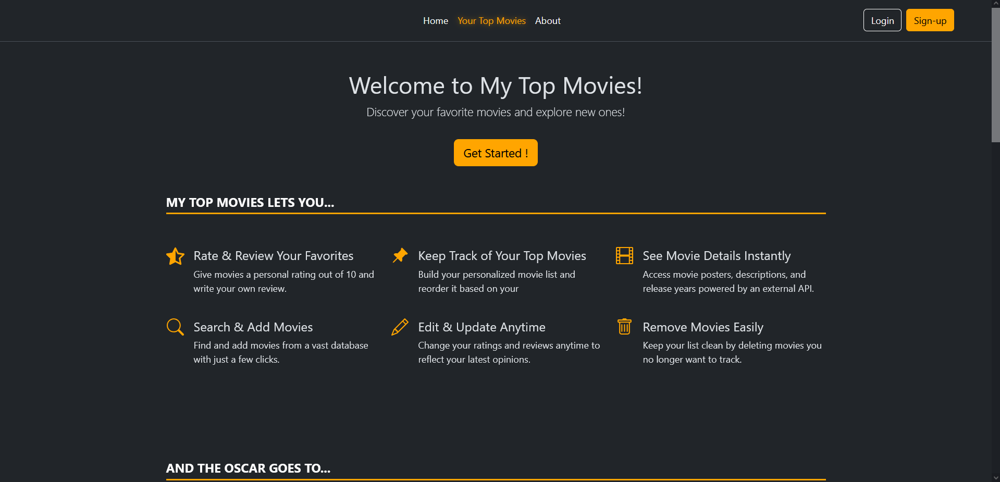
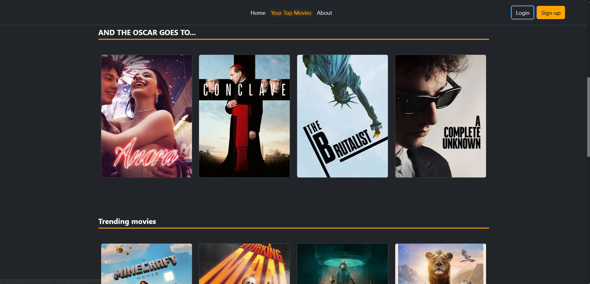
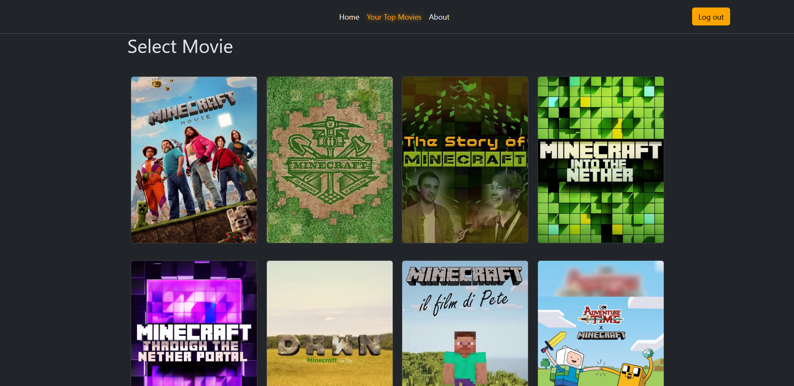
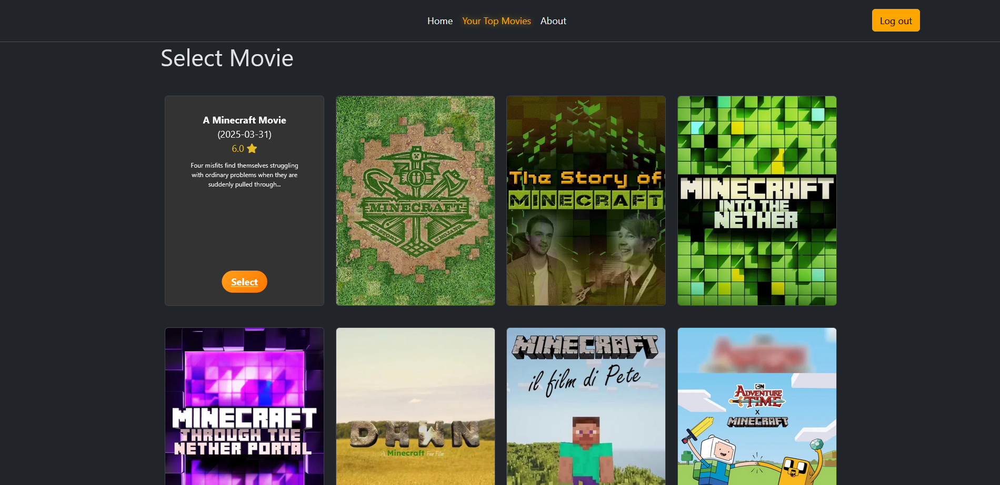
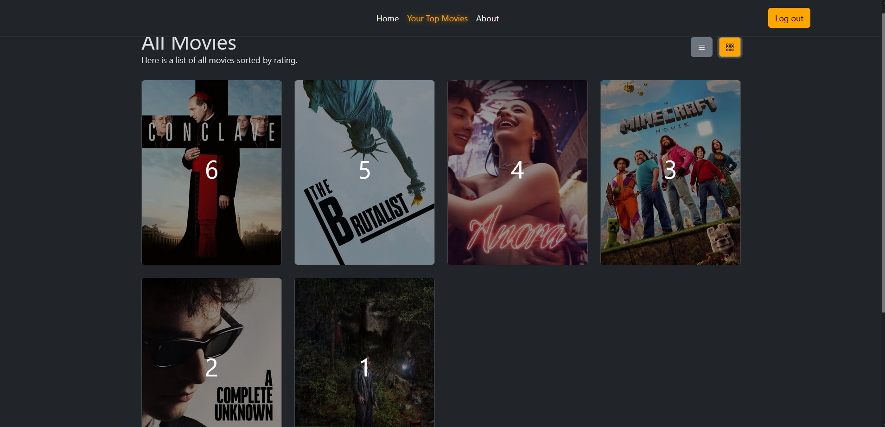
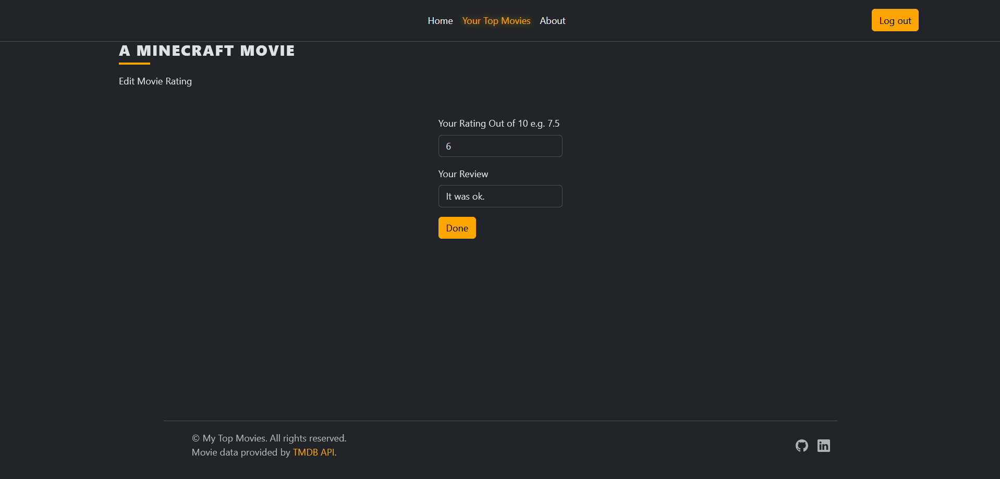

# 🎬 My Top Movies

**My Top Movies** is a full-stack Flask web application that lets users search for films via the [TMDB API](https://www.themoviedb.org/), crate a personalized top movie list, and manage reviews and ratings in a clean and responsive UI.

Deployed with [Render](https://render.com/), this project also features user authentication, API integration, dark mode styling, and custom UI animations.

[](https://flask.palletsprojects.com/) [](https://www.themoviedb.org/documentation/api)

---

## 🌟 Features

- 🔐 **User Registration & Login** – Secure authentication system with password hashing.
- 🔍 **Movie Search** – Find movies using the TMDB API and select them from search results.
- ⭐ **Rate & Review** – Assign a score out of 10 and leave a custom review.
- 📋 **Top Movies** – Manage your personalized list, sorted by rating.
- 🖊️ **Edit & Delete** – Modify your ratings or remove a movie anytime.
- 🧠 **Smart Duplicate Check** – Prevent adding the same movie twice.
- 🎨 **Responsive UI** – Bootstrap 5 + custom styles, mobile-friendly design.
- 🍿 **Interactive Effects** – Custom JavaScript animations (like popcorn burst 🎉).
- 🧪 **API-Driven Content** – Live trending and Oscar-predicted movies from TMDB.
- 🌍 **Deployed on Render** – With a `/ping` route for UptimeRobot integration.

---

## 🖼️ Screenshots  
*Click any image to view it in full size.*


| 🏠 Home Page (Not Logged In) | 🏆 Oscar & Trending Movies |
|-----------------------------|----------------------------|
|       |  |

| 🔍 Search & Add Movies       | ✅ Add to Top              |
|-----------------------------|----------------------------|
|           |   |

| 🎞️ Your Top Movies (List View) | 🧾 Edit Rating         |
|--------------------------------|------------------------|
|     |        |

---

## 🎥 Optional Demo Video

👉 Add a 30-60s screen recording of:
- Searching for a movie
- Adding it to your list
- Editing rating/review
- Logging out

You can record it with:
- **OBS Studio**, **Loom**, or **Screenity** (Chrome extension)
- Save as `.mp4` or convert to `.gif` with ezgif.com

Upload to GitHub repo under `/demo/demo.mp4` or embed from YouTube.

---

## 🚀 Getting Started

### ✅ Prerequisites

- Python 3.x
- `pip` or `venv`
- TMDB API Key (get one [here](https://www.themoviedb.org/documentation/api))
- `.env` file with:

```env
FLASK_SECRET_KEY=your-secret-key
TMDB_API_KEY=your-tmdb-key
```

---

### 🛠 Installation

```bash
git clone https://github.com/RuginaAlex/my-top-movies.git
cd my-top-movies
pip install -r requirements.txt
python main.py
```

Visit `http://127.0.0.1:8081` in your browser.

---

## 📁 Project Structure

```
my-top-movies/
├── static/
│   ├── css/styles.css
│   └── assets/img/
├── templates/
│   ├── base.html, index.html, all-movies.html, ...
├── instance/
│   └── top-films.db  (auto-created)
├── main.py
├── requirements.txt
└── README.md
```

---

## ⚙️ Tech Stack

| Tech        | Purpose                           |
|-------------|------------------------------------|
| Flask       | Backend web framework              |
| Flask-Login | User authentication                |
| SQLite      | Lightweight database               |
| Bootstrap 5 | Frontend styling (dark theme)      |
| Jinja2      | HTML templates with logic          |
| TMDB API    | Fetching movie data                |
| Render      | Free cloud deployment              |
| UptimeRobot | Keep-alive pinging for free tier   |

---

## 🤝 Contributions

This project is a personal educational app built to showcase full-stack Python + Flask skills.

If you’d like to contribute, open a pull request or reach out via:

- 📧 [LinkedIn](https://www.linkedin.com/in/mircea-alexandru-rugin%C4%83-1b461b270/)
- 💻 [GitHub](https://github.com/RuginaAlex)

---

## 🔗 Credits

Movie data provided by [TMDB API](https://www.themoviedb.org/documentation/api)  
Icons by [Bootstrap Icons](https://icons.getbootstrap.com/)  
Project built by **Mircea-Alexandru Rugină**
